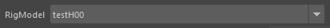

# MotionCopy manual

The following text is a machine translation.

## summary

- Prepare a scene with a model with a rig set. (The model is a reference)
- This tool reads the existing motion with the reference, transfers the motion to the rig, and saves the mb.

## execution

## Rig to be transplanted

- Open the rig scene
- Make sure the rig name is displayed in the RigModel pull-down.  
If there are multiple rigs in the scene, specify which rig to port to.

## MotionCopyFileList

> Record the relationship between each rig and joint in mcf.

- `ListReLoad` : reload MotionCopyFileList.
- `make mcf` : Create a mcf with a save name.
- Right-click `mcf open` : Open the mcf in a text editor.
- Right-click `mcf Dir` : Open the mcf folder.

> mcf is created in the mcf folder of the project.

## ReferenceListFile

> List of preset saved files with multiple motions to be ported

- `SaveList` : Enter a save name to save the MotionReference motion list rlf.

> The rlf is created in the mcf folder of the project folder.

## About Buttons

- `RangeCopy` : Implant the time slider range.
- `currentCopy` : Only the current frame is transplanted.
- `mbSave` : Save the file with the name `save mbName`.
- `ReferenceAllCopy` : Transplant the mb's on the MotionReference list in order.
- `ReferenceFolder` : Load a list of mb files in a folder into MotionReference
- `ReferenceEditor` : Existing ReferenceEditor
- `ReferenceDelete` : Select an item in the MotionReference list and delete it (can be duplicated)
- `ReferenceUnload` : Select an item in the MotionReference list to unload it

## status bar

> Transplant progress bar

## Porting range and output name

> For each motion, a porting range and output name can be specified.

- `StartFrame` : The first frame. Saved internally immediately after editing.
- `EndFrame` : Last frame. Saved internally immediately after editing.
- `save mbName` : Name of mb to be saved after transplant.  
Initial names end with _sample. The name is saved internally immediately after editing.
- `keyOnly` : If the key is on the rig. Mode to copy only where the key is located (basically off because it sometimes doesn't give very good results).
- `filter` : Key reduction with Euler filter after motion transplant. (Basically off, since the result may not be very good)

> `SaveList` The edited frame range and name for each motion will be saved in the rlf file by doing the following.

## MotionReference

- `MotionReference` : A list of files to be transplanted is displayed.
- Right-click to delete and unload.
- The time slider will automatically change within the keyed range of the selected motion scene.  
The startFrame and EndFrame are also changed.  
Check each motion and edit the startFrame and endFrame,  
as there can be wrong ranges, such as unnecessary keys in the motion data on unintended frames.

## Work Flow

- Create with `make mcf`, Load the motion to be ported in the `ReferenceFolder` or `ReferenceEditor`.
- MotionReference By selecting any mb, the reference is loaded.
- With mb loaded, double click on mcf to open CopyTableEdit.

## CopyTableEdit : Editing mcf files

- `TextSearch` : Used to search for characters in a table. When a hit occurs, the cell turns green.
- `AutoSave` : Every edit should be saved (unused and possibly buggy)
- `close` : Closes the table. Does not save.
- `Save` : Save
- `SaveAs` : Save as (unused and possibly buggy)
- `FileOpen` : Open the table in a text editor.

Button to add a process to the last row of the table

- `Add_comment` : Add a comment to the last line
- `Add_change` : Add the retarget settings to the last line
- `Add_pv` : Add item for pole vectors to last line
- `Add_MEL` :  Add MEL to the last line
- `Add_ADJUST` : (unused and unknown)
- `Add_Apos` :  Retarget the intermediate coordinates of multiple node coordinates
- `Add_CVpos` :  Create a curve from the joint and transform the CV coordinates to retarget

### line-by-line processing

> MotionCopy copies in order from the parent node.  
Note the order of processing so that children are not processed first.
> We will use `change` to explain the contents of the one-line process.

- DEL deletes items.
- Checkboxes can enable or disable processing during copying.
- The `change` button is the processing content of this line. You can add a new line by right-clicking on it.
- The “Head” entry specifies the motion data node.
- The “x y x y” sets the direction of the motion and rig axes.  
Basically, try copying once with x y x y and if the angles are wrong, try x y z x, etc.
- The part entered as Head_FK_ctrl refers to the rig's controller.
- 0 1 0 means move, rotate, copy scale or not. 0 means not, 1 means yes.  
Entering 2 again forces the value to 0.

### How to insert a line above a line

> Such as the `change` button described above. Right click on each button to get a list.

- `insert comment` : Row to enter comments
- `insert change` : Basic ReTargets
- `insert CVpos` :  Create a curve from the joint and transform the CV coordinates to retarget
- `insert pv` : Processing for pole vectors
- `insert AddLoc` : You can add a locator, offset it, and retarget the locator with `change`.
- `insert ADJUST` : unused
- `insert FOLLOW` : unused
- `insert Apos` :  Retarget the intermediate coordinates of multiple node coordinates
- `insert IKpos` : Processing for IK
- `insert ATTR` : Process to copy 1 node and 1 attribute
- `insert AttrD` :  Forgot
- `insert COND` :  Forgot
- `insert MEL` : Execute MEL script
- `insert SIZE` : Change node size

### change

Function name change(mnAC), joint to reference, orientation A, orientation B, orientation C, orientation D, controller to place, movement enabled, rotation enabled, rotation X correction, rotation Y correction, rotation Z correction
  
Orientation ABCD where AB is the orientation and up vector of the reference joint and CD is the orientation and up vector of the rig.  
If X is opposite, write xi.  
Or, if you add a node to the reference and make it a locator that references it, you can copy even diagonal joints.

### pv

3 joints (shoulder to hand), pole vector controller, 1,0,0,0,0 (fixed values as it is movement only)  
Calculate and place the position of the pole vectors at the three joints.

### AddLoc

Specify joint where locator is to be placed, name of locator, local position and rotation from joint  
Offset with this locator if the joints in the motion data are poorly positioned.

### ADJUST (unused)

ADJUST 、A node, B node, controller, moving value  
Get a vector from node A to node B.  
Move the controller by the magnification factor.  
This is an adjustment process for different character sizes.  
Move the position of the waist, etc. without Resize.  
This is for simple adjustment.  
yjp_PhysiqueAdjust.

### FOLLOW (unused)

Mesh, new node, xyz, 0, 100, 0 (offset)
It is expected to adjust the position of Ground when in the air.  
If there is a mesh in the air above Y0, expect Ground_FK_ctrl to be lowered below the mesh by an arbitrary value.  
Internally, yjp_GroundFollow is used.  
Ability to make the Ground controller follow the mesh of the body

### Apos

Controller, multiple motion nodes (2 or more)  
Places the controller in the middle position of multiple motion nodes.  
Use when the joint position of the original data is bad and you want to copy at the middle position of two or more joints.

### IKpos

3 joints, end IK controller input  
Pose the arms and legs of the original motion to the same vector and angle on the rig controller.  
The position of the ends may not match the original data. Mainly used for arm IK.

### ATTR

Process to copy 1 node and 1 attribute

### AttrD (unknown)

### COND (unknown)

### MEL

You can execute a process that can be written on a single line.  
If you want to do something complicated, create a procedure and run it.  
Here is an example

- `yjp_FKIKctrlKeyCopy ID:HandL_IK_ctrl`.  
Running this after copying the FK controller with `change` will convert FK to IK and hit the key.

- `yjp_rig_floorAdjust`.  
After copying the foot controller with `change`,  
Process to move them to match the ground height Y0 with `yjp_rig_floorAdjust`.

- `yjp_anm_IKLengthLimit ID:FootL_IK_ctrl 0.0`.  
After copying IK controllers with `change`,  
Running it when the IK is pulled more than necessary will move the controller to the end of the IK joint.  
The last value of 0.0 is at the IK maximum distance. Increasing the value should shrink the IK, but it does not work.
Same process as `IKLengthLimit0.0` in `AnimationWorkTool`.

- `yjp_rig_centerAdjust`  
unknown

- `yjp_rig_SIKendOrientation`  
unknown

### SIZE

Change the scale of the motion data node.  
Root node of motion data, shrink at 0.98, enlarge at 1.09, etc.
If the root node of the original data has an animation key, a parent node must be created.
