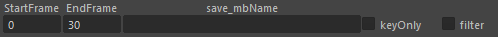
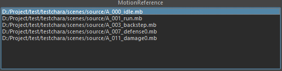
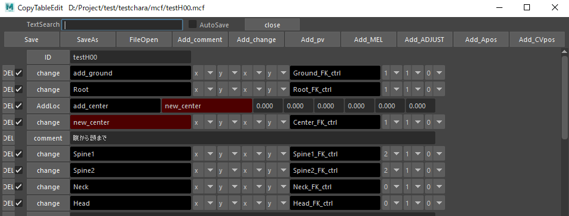
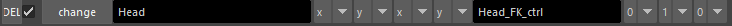
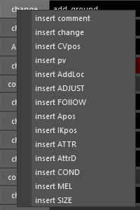

# MotionCopy

## MotionCopyの概要

- リグをセットしたモデルがあるシーンを用意します。（モデルはリファレンス）
- 既存モーションをリファレンスで読み込みリグにモーションを移植しmb保存するツールです。

## 実行

S_TOOL > Animation > MotionCopy

## 移植するリグ

- リグシーンを開きます
- RigModelプルダウンからリグ名が表示されていることを確認します。  
シーンに複数リグがある場合どのリグに移植するかを指定します。

## MotionCopyFileList

> 各リグとジョイントの関係をmcfで記録します。

- `ListReLoad` : MotionCopyFileListをリロードします。
- `make mcf` : 保存名を決めるとmcfが作られます。
- 右クリック `mcf open` : テキストエディターでmcfを開きます。
- 右クリック `mcf Dir` : mcfフォルダを開きます。

> mcfはプロジェクトのmcfフォルダに作られます。

## ReferenceListFile

> 移植する複数のモーションをプリセット保存したファイルのリスト

- `SaveList` : 保存名を入力するとMotionReferenceのモーションリスト rlf が保存されます。

> rlfはプロジェクトフォルダのmcfフォルダに作られます。

## ボタンについて

- `RangeCopy` : タイムスライダー範囲を移植する。
- `currentCopy` : カレントフレームのみ移植する。
- `mbSave` : `save mbName`名で保存する。
- `ReferenceAllCopy` : MotionReferenceリストにあるmbを順に移植していく。
- `ReferenceFolder` : フォルダ内のmbファイルリストをMotionReferenceに読み込む
- `ReferenceEditor` : 既存のReferenceEditor
- `ReferenceDelete` : MotionReferenceリスト内項目を選択して削除（複可）
- `ReferenceUnload` : MotionReferenceリスト内項目を選択してアンロード

## ステータスバー

> 移植進捗のバー

## 移植範囲と出力名

> 各モーションごとに移植範囲と出力名を指定できます。

- `StartFrame` : 始めのフレーム。編集直後、内部保存されます。
- `EndFrame` : 最後のフレーム。編集直後、内部保存されます。
- `save mbName` : 移植後の保存するmb名。  
初期名は語尾に_sampleが付きます。編集直後、内部保存されます。
- `keyOnly` : リグの方にキーがある場合。キーがある箇所だけコピーするモード（あまりいい結果にならない事があるので基本オフ）
- `filter` : モーション移植後オイラーフィルターでキーリダクションします。（あまりいい結果にならない事があるので基本オフ）

> `SaveList` することで、各モーションでフレーム範囲と名称を編集した内容がrlfファイルに保存されます。

## MotionReference

- `MotionReference` : 移植するファイルリストが表示されます。
- 右クリックで削除とアンロードが可能。
- 選択したモーションシーンのキーがある範囲でタイムスライダーが自動的に変更されます。  
startFrameとEndFrameも変更されます。
モーションデータに不要なキーが意図しないフレームにあるなど、間違った範囲になることもあるので、各モーションを確認してstartFrameとEndFrameを編集してください。

## 作業の流れ

- make mcfで作成したあと移植するモーションを `ReferenceFolder` もしくは `ReferenceEditor` で読み込みます。
- MotionReference で任意のmbを選択する事でリファレンスロードされます。
- mbがロードされた状態でmcfをダブルクリックするとCopyTableEditが開きます。

## CopyTableEdit　mcfファイルの編集

- `TextSearch` : テーブル内の文字を検索する時に使用します。ヒット時セルが緑になります。
- `AutoSave` : 編集するたびに保存されるはず（未使用のため怪しい）
- `close` : テーブルを閉じます。保存はしません。
- `Save` : 保存
- `SaveAs` : 別名保存（未使用のため怪しい）
- `FileOpen` : テーブルをテキストエディターで開きます。

最後の行に処理を追加するボタン

- `Add_comment` : コメントを最後の行に追加
- `Add_change` : リグとジョイントのターゲット設定を最後の行に追加
- `Add_pv` : ポールベクター用の項目を最後の行に追加
- `Add_MEL` :  
- `Add_ADJUST` :  
- `Add_Apos` :  複数のノード座標の中間座標をリターゲットする
- `Add_CVpos` :  ジョイントからカーブを作りCV座標を変換してリターゲットする

### 行単位で処理

> MotionCopyは親ノードから順にコピーをしています。  
子が先に処理されないように処理の順に注意してください。
> 1行処理の内容を `change` で解説をしていきます。

- DELは項目を削除します。
- チェックボックスはコピー時に処理を有効にしたり無効にできます。
- `change` ボタンはこの行の処理内容です。右クリックで上に1行追加できます。
- Headと入力されている箇所はモーションデータのノードを指定しています。
- x y x y となっているところはモーションとリグの軸の向きを設定しています。  
基本的には x y x y で一度コピーしてみて角度がおかしければ x y z x など試してください。
- Head_FK_ctrlと入力されている箇所はリグのコントローラの事です。
- 0 1 0 は　移動　回転　スケールをコピーするかしないか。0はしない。1はする。  
また2を入力すると値が強制的に0になります。

### 一行上に行を挿入する方法

> 上記の説明であった `change` ボタンなど。各ボタンを右クリックするとリストが出ます。

- `insert comment` : コメントを記入する行
- `insert change` : 基本的なターゲット
- `insert CVpos` :  ジョイントからカーブを作りCV座標を変換してリターゲットする
- `insert pv` : ポールベクター用の処理
- `insert AddLoc` : ロケーター追加してオフセットし、ロケーターを `change` でリターゲットできます。
- `insert ADJUST` : 未使用
- `insert FOLLOW` : 未使用
- `insert Apos` :  複数のノード座標の中間座標をリターゲットする
- `insert IKpos` : IK用の処理
- `insert ATTR` : １ノードと１アトリビュートをコピーする処理
- `insert AttrD` :  忘れた
- `insert COND` :  忘れた
- `insert MEL` : MELスクリプトを実行
- `insert SIZE` : ノードのサイズを変更

### change

> 機能名change(mnAC)、参照するジョイント、向きA、向きB、向きC、向きD、配置するコントローラー、移動有効、回転有効、回転X補正、回転Y補正、回転Z補正  
向きABCDはABが参照ジョイントの向きとアップベクトル、CDがリグの向きとアップベクトルです。  
Xが反対の場合はxiと書きます。  
もしくはリファレンスにノードを追加して参照するローケーターとすれば斜めのジョイントでもコピーすることができます。

### pv

> 3つのジョイント（肩から手まで）、ポールベクターコントローラ、1,0,0,0,0(移動のみなので数値は固定)  
ポールベクターの位置を3つのジョイントで計算して配置する。

### AddLoc

> ロケーターを配置するジョイントを指定、ロケーターの名前、ジョイントからのローカル位置と回転  
モーションデータのジョイントの位置が悪い場合このロケーターでオフセットする。

### ADJUST 不明。バグっている可能性大

> ADJUST 、Aノード、Bノード、コントローラ、移動値  
AノードからBノードのベクトルを取得して  
コントローラを倍率分移動させる。  
これもキャラクターサイズが異なる調整処理です。  
Resizeせずに腰の位置を移動させるなど簡単な調整用です。  
yjp_PhysiqueAdjustを使用している。

### FOLLOW 不明

> メッシュ、新規ノード、xyz、0、100、0（オフセット）
空中にいる時のGroundの位置を調整するものと思われる。  
Y0より空中にメッシュがある場合Ground_FK_ctrlをメッシュより下に100下げると予想  
内部ではyjp_GroundFollowを使用している。  

### Apos

> コントローラー、複数のモーションノード（2つ以上）  
複数のモーションノードのアベレージした位置にコントローラーを配置する。  
元データのジョイント位置が悪い場合、２つ以上のジョイントの中間位置でコピーしたい場合に使用する。

### IKpos

> 3つのジョイント、末端IKコントローラを入力  
元モーションの腕や足のポーズをリグコントローラでも同じベクトルと角度にする。  
なので末端の位置は元データと合わない事がある。主に腕IKで使用する。

### ATTR

### AttrD

### COND

### MEL

> 一行で書ける処理を実行できます。  
複雑なことをしたい場合はプロシージャーを作って実行します。  
以下が例です。

- `yjp_FKIKctrlKeyCopy ID:HandL_IK_ctrl`  
`change` でFKのコントローラをコピーした後に実行するとFKをIKに変換してキーを打ちます。

- `yjp_rig_floorAdjust`  
`change` で足のコントローラーをコピーした後、  
`yjp_rig_floorAdjust`で地面の高さY0に合うように移動させる処理

- `yjp_anm_IKLengthLimit ID:FootL_IK_ctrl 0.0`  
`change` でIKコントローラーをコピーした後、  
IKが必要以上に引っ張られた時に実行するとIKジョイント末端にコントローラが移動します。  
最後の値が0.0でIK最大距離の位置に。値を増やすとIKが縮むはずが機能しない。
`AnimationWorkTool` の `IKLengthLimit0.0` と同じ処理

- `yjp_rig_centerAdjust`  
不明

- `yjp_rig_SIKendOrientation`  
不明

### SIZE

> モーションデータのノードのスケールを変更します。  
モーションデータのルートノード、0.98で縮小、1.09で拡大するなど。
元データのルートノードにアニメーションキーがある場合は親ノードを作る必要がある。
