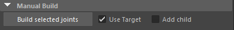
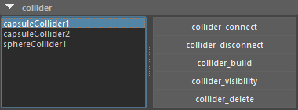

# yjp_boneDynamicsNode_ui

Akasaki's boneDynamicsNode seemed useful, so I created a tool to simplify the setup and bake process.

[GitHub boneDynamicsNode](https://github.com/akasaki1211/boneDynamicsNode)  
[GitHub maya_expressionCollision](https://github.com/akasaki1211/maya_expressionCollision)  
[qiita Japanese Explanation](https://qiita.com/akasaki1211/items/ddae66ec2d89d21bb2f4)

## Install

`boneDynamicsNode` `maya_expressionCollision` Please refer to the above for download.

- s_MayaScripts If you use this, please go to [Notes](#notes).

- Which of the following is a way to use `BoneDynamics_ui` by itself, without using s_MayaScripts :
  - Copy the `bdn` folder to `C:¥Users¥Documents¥maya¥scripts`  
  - Add the parent directory of `bdn` to the PYTHONPATH environment variable
  - Add `bdn` parent directory to PYTHONPATH in Maya.env  

- To use collision
  - DL `maya_expressionCollision`.
  - Please put the folder `expcol` on the same level as `bdn`

## Notes

- As I don't have extensive knowledge of Python, there might be some bugs or issues in the script.
- The author assumes no responsibility for any damages or problems that may arise from the use of this script. Please use it at your own risk.
- This has been tested in Maya 2025. Always save your work before running the script.
- While the script is designed to build and bake multiple chains together, running these processes separately might lead to more stable results.
- Setting the Evaluation mode to `DG` in Preferences > Settings > Animation > Evaluation might improve stability.

## Basic Usage

The UI will appear when you do the following

S_TOOL > Animation > BoneDynamics_ui in s_MayaScripts

or click here

```python
from bdn import yjp_bone_dynamics_ui
yjp_bone_dynamics_ui.bone_dynamics_ui()
```

### Quick Guide

1. Save the current scene.
2. Select the joints you want to sway in order from the parent to the end, one row at a time.
3. Press `Build Selected Joints` .
4. Select the FK controllers controlling the joints you want to sway in order from the parent.
5. Check if the joint root selected in step 1. is selected in `Chain Root List` .
6. Press `Selected Get Ctrl` .
7. Press `Connect Target Ctrl` .
8. Repeat steps 2 to 7 for other rows if necessary.
9. Select the joints from `Chain Root List` (multiple selections allowed).
10. Adjust the parameters of `bonedynamics attr`.
11. If interference occurs, add a collider.
12. Select the joint to which you want to add a collider and press the collider type button.
13. Adjust the position, radius, and height of the collider.
14. Select the added collider from the collider list.
15. Select the joints affected by the collider from the `Joint List` and press `collider_connect`.
16. Repeat steps 11. to 14. to add colliders if other interferences occur.
17. Save each setting with `Preset Save` .
18. If the movement is satisfactory, press `Chain Bake`.
19. The dynamics-related nodes are deleted, and the original connections are restored.
20. Delete the collider with `Collider_Delete`.

### Procedure when there is saved data

1. Load the JSON file from the saved list on the left using `Preset Load`
2. Joints will be loaded into the `Chain Root List`. Select multiple joints and press `Chain Build`
3. Select multiple colliders from the collider list and press `Collider Build`
4. If the movement looks good, press `Chain Bake`
5. Delete colliders using `Collider Delete`

Select the bound joints to create a boneDynamicsNode, edit parameters, add colliders if necessary, and then execute the bake.
If there is motion on the joints or controllers to be baked, it will be overwritten.
After creating the boneDynamicsNode, you can switch to rig controller control.

## UI Description

## preset

  
The json file is saved in the bdn folder of the project folder.

The text scroll on the left lists the json files.  
You may want to separate json files by hair and clothing.

- `Preset Save` : Save the following information
  - source joint
  - Parameters of boneDynamicsNode
  - Add child position
  - driven joint
  - Target joint
  - Target Controller
  - Collider
  - Collider position and size
  - Collider parent
  - Joint to which the collider connects
- `Preset Load` : Load a json file.

The information in the scene is kept in dict while you are working.  
When you `Preset Save`, the information in the scene is added to the dict and saved.  
When you reopen the UI, the dict is initialized.  
When you do a `Preset Load`, the dict is overwritten.  
Select a json, right-click on it, and `load` to open the json in a text editor.

## Manual Build

  

- `Build Selected joints` : Select the joints you want to shake in the scene, starting from the parent, and press the button.  
When you build, the nodes to shake the joints will be installed.
- `Use Target` : Create target joints at build time.  
Basically, it should be ON.
- `Add child` : Add a child to the end at build time.  
If a joint has only one chain, add a child to the end of the chain because it needs an end. Or add more ends to a joint that has weighted ends.

Adjust the position of the _lastadd joint added with `Add child`.  
The position of the `_lastadd` joint will be saved when you `Preset Save`.

## Build and Bake

  

- `Chain Root List` : parent joints of the chain are listed  
Build or bake the chain selected here. (Multiple selections are possible.)  
When selected, the child joints will also appear in the `bonedynamics attr` UI.

- `Chain Build` : Builds a chain selected from the `Chain Root List` after loading it with `Preset Load`. Multiple selections are possible.
- `Cahin Bake` : Bakes a range of time sliders. Dynamics will be removed after baking.
- `Dynamics Remove` : remove dynamics nodes from the selected chain.
- `Chain Delete` : Delete loaded chain items. The dynamics node will also be deleted if it exists.

> Load the json file and you will see the chain list and collider.  
Chains that have not been built will not appear in the `Joint List`.  
Select a chain and run `Chain Build`.
Select a collider and run `collider Build`.

## target list

  

It seems better to use a target joint in most cases.  
If you have a rig, you can control the target joint with the FK controller.  
It is also okay to move the target joint directly without running Connect Target Ctrl.  
In this case it will be baked into the bind joint.

- `target list` : The target will appear in the list when used. When selected, target joints in the scene are also selected.
- `Ctrl List` : Controllers such as rigs are listed. When selected, the controllers in the scene will also be selected.
- `Selected Get Ctrl` : Selecting a rig or other controller from parent to child and then executing will add it to the list.
- `Connect Target Ctrl` : Run with selected controllers in the `Ctrl List` to control dynamics joints with rig controllers.  
When baked, it will be baked to this rig controller.

## bonedynamics attr

  

- `Joint List` : Lists the hierarchical joints of the chain selected in the `Chain Root List`.  
Multiple chains can be selected.

> Selecting a joint displays the bonedynamics attribute of that joint.  
Each attribute can be edited simultaneously with multiple selections.

- `Reset Time` : Start frame of the simulation.  
- `Damping` : Dampens the velocity. The higher the value, the harder it is to accelerate (like in water).
- `Elasticity` : force to return to the original position. Default 30, but can be 60 for long hair.
- `Stiffness` : suppresses the change between frames (steps). If set to 1, the sway will be lost.
- `Mass` : affects the force to return to the original posture. 0.1 means almost no shaking.
- `Gravity` : Set to [0,-980,0] for Y-up and units in centimeters.
- `Gravity Multiply` : gravity will be multiplied. degree of Gravity applied. Set to 0 if target is used.
- `enableAngleLimit` : 1 to enable the range of motion limit.
- `angleLimit` : Angle of motion.
- `Radius` : The radius of the end-joint hit.
- `Iterations` : The higher the value, the more accurate the collision. Recommended value is between 3 and 5. 0 disables collisions.
- `Enable Ground Col` : Enable ground collision.  
- `Ground Height` : Ground height.

## collider_create


> Create a collider where the set joints of bonedynamics collide.

- Select the node that will parent the collider before creating it.  
 `sphere` `capsule` `capsule2` `iplane`  
If you choose nothing, you will be a global child.
- Adjust the position, angle, radius, and height of the collider manually.

## collider



- A list of colliders is displayed.  
When selected, the collider for the scene is also selected

> Selecting one of the colliders in the list will select the joints connected in the `Joint List`.  
All the following buttons allow multiple selection of items in the list.

- `collider_Connect` : select a collider in the list, select a joint in the `Joint List`, and run it to connect with the joint to which the collider is applied.
- `collider_Disconnect` : select a collider in the list, select a joint in the `Joint List`, and run it to disconnect it.
- `collider_Build` : after `Preset Load`, it will build the collider and set its position, angle, size and connect.
- `collider_Visibility` : hides the collider.
- `collider_Delete` : delete the collider. If you set `Preset Save`, the deleted collider will not be saved.

## processing details

- When built, the source joint is controlled as follows.  
source joint ← driven joint ← bonedynamics ← target joint ← rigctrl

- Bake the driven joints, then delete the bonedynamics target joints, and then bake the driven joints to the rigctrl.  
Rigctrl bakes driven joints and then deletes driven joints.

## unsupported

- Offset conversion
- Scale

## Other

- If the space between the joints is wide, the collision will be removed.  
    I hope the dynamics will be capsule determined as well.
- Binding joints with non-hierarchical chain structures should also be supported. I have not debugged it yet.
