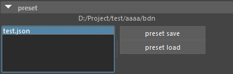
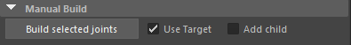
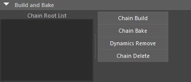
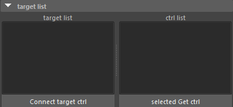
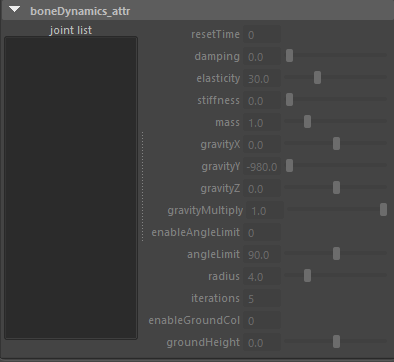
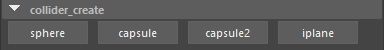
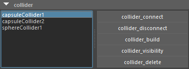

# yjp_boneDynamicsNode_ui

あかさき氏が作成された boneDynamicsNode が便利そうだったので、設定やベイクをしやすくるツールを作ってみました。

[GitHub boneDynamicsNode](https://github.com/akasaki1211/boneDynamicsNode)  
[GitHub maya_expressionCollision](https://github.com/akasaki1211/maya_expressionCollision)  
[qiita日本語解説](https://qiita.com/akasaki1211/items/ddae66ec2d89d21bb2f4)

## インストール

`boneDynamicsNode` `maya_expressionCollision` を上記を参考にダウンロードしてください。

- s_MayaScriptsを使用する場合は[注意事項](#注意事項)に進んでください

- s_MayaScriptsを使用せずに `BoneDynamics_ui` を単品で使用する方法は以下のどれか :  
  - `bdn`フォルダを`C:¥Users¥Documents¥maya¥scripts`にコピー  
  - `bdn`の親ディレクトリを環境変数 PYTHONPATH に追加  
  - Maya.envの PYTHONPATH に`bdn`の親ディレクトリを追加  

- コリジョンを使用するために
  - `maya_expressionCollision` をDLします
  - expcolフォルダを`bdn`と同階層においてください

## 注意事項

- pythonの知識はあまりないので、不具合もあるかと思います。
- このスクリプトの使用によって生じたいかなる損害や問題についても、作者は一切の責任を負いませんので、承知の上でご利用ください。
- Maya2025で検証しています。実行する前にかならず保存してから実行してください。
- 複数のチェーンをまとめてビルド、まとめてベイクができるように作っていますが、分割して実行するほうが安定する可能性があります。
- Preferences > Settings Animation > Evaluatio > Evaluatio mode を DGにすると安定するかもしれません。

## 基本的な使い方

以下を実行するとUIが表示されます。

s_MayaScripts の S_TOOL > Animation > BoneDynamics_ui

またはこちら

```python
from bdn import yjp_bone_dynamics_ui
yjp_bone_dynamics_ui.bone_dynamics_ui()
```

### クイックガイド

1. 現在のシーンを保存する
2. 揺らしたいジョイントを１列単位で親から末端まで順に選択
3. `Build Selected joints` を押す
4. 揺らしたいジョイントを制御しているFKコントローラを親から順に選択
5. `Chain Root List` で 1. で選択したジョイントルートが選択されているか確認
6. `Selected Get Ctrl` を押す
7. `Connect Target Ctrl` を押す
8. ほかの列があれば 2. 7. を繰り返す
9. `Chain Root List` からジョイントを選択する(複数可)
10. `bonedynamics attr` のパラメータを調整する
11. 干渉が発生してしまう場合コライダーを追加する
12. コライダーをつけるジョイントを選択してコライダータイプボタンを押す
13. コライダーの位置調整やRadiusとHeightを調整する
14. コライダーのリストから追加したコライダーを選択
15. `Joint List` からコライダーの影響を受けるジョイントを選択して `collider_connect`
16. ほかの干渉があれば 11. 14. を繰り返してコライダーを追加する
17. `Preset Save` で各設定を保存しておく
18. 動きを確認してよければ `cahin Bake` を押す。
19. ダイナミクス関連のノードが削除され、元のコネクトに戻る。
20. `collider_delete` でコライダーを削除する

### 保存したデータがあるときの手順

1. `Preset Load` で保存した左のリストからjsonファイルを読み込む
2. `Chain Root List` にジョイントが読み込まれるので複数選択して `chain build` を押す
3. コライダーのリストからコライダーを複数選択して `collider_build` を押す
4. 動きを確認してよければ `cahin Bake` を押す
5. `collider_delete` でコライダーを削除する

バインドされたジョイントを選択してboneDynamicsNodeを作り、パラメータを編集、必要であればコライダーを追加、そしてベイクを実行します。  
ベイクするジョイントやコントローラにモーションがある場合は上書きされます。
boneDynamicsNodeを作った後リグコントローラ制御にできます。

## UIの説明

## preset

  
プロジェクトフォルダのbdnフォルダにjsonファイルが保存される。

左のテキストスクロールはjsonファイルがリストアップされます。  
髪や服でjsonファイルを分けるといいかもしれません。

- `Preset Save` : 以下の情報を保存します
  - ソースジョイント
  - boneDynamicsNodeのパラメータ
  - Add childの位置
  - ドリブンジョイント
  - ターゲットジョイント
  - ターゲットコントローラ
  - コライダー
  - コライダーの位置やサイズ
  - コライダーの親
  - コライダーのコネクトするジョイント
- `Preset Load` : jsonファイルを読み込む。

作業中はシーン内の情報をdictで保持しています。  
`Preset Save` した時にシーン内の情報をdictに追加して保存します。  
UIを開きなおすとdictが初期化されます。  
`Preset Load` をするとdictが上書きされます。  
json を１つ選択し右クリックして `load`するとjsonをテキストエディターで開くことが出来ます。

## Manual Build

  

- `Build Selected joints` : シーンの揺らしたいジョイントを親から順に選択してボタンを押します。１列単位で実行します。  
ビルドするとジョイントを揺らすノードが仕込まれます。
- `Use Target` : ビルド時にターゲットジョイントを作成します。  
基本的にはONでいいかと思います。
- `Add child` : ビルド時に末端に子を追加します。  
チェーンが一つだけのジョイントは末端が必要なため追加します。または末端にウエイトがあるジョイントにもさらに末端を追加します。

`Add child` で追加された_lastaddジョイントの位置を調整してください。  
`Preset Save` 時に_lastaddジョイントの位置が保存されます。

## Build and Bake

  

- `Chain Root List` : チェーンの親ジョイントがリストされます  
ここで選択したチェーンをビルドやベイクをします。（複数選択可）  
また選択すると `bonedynamics attr` UIに子のジョイントが表示されます。

- `Chain Build` : `Preset Load` で 読み込んだ後 `Chain Root List` から選択したチェーンをビルドします。複数選択可
- `Cahin Bake` : タイムスライダーの範囲をベイクします。ベイク後dynamicsは削除されます。
- `Dynamics Remove` : 選択したチェーンのダイナミクスノードを消します。
- `Chain Delete` : ロードしたチェーン項目を削除します。ダイナミクスノードも在れば消します。

> jsonファイルをロードするとチェーンリストやコライダーが表示されます。  
ビルドされていないチェーンは `Joint List` に表示されません。  
チェーンを選択して `Chain Build` を実行してください。
コライダーを選択して `collider Build` を実行してください

## target list

  

ほとんどのケースでターゲットジョイントを使用するほうが良さそうです。  
リグがある場合はターゲットジョイントをFKコントローラーで制御できます。  
Connect Target Ctrl を実行せずターゲットジョイントを直接動かしても問題ないです。  
この場合バインドジョイントにベイクされます。

- `target list` : ターゲットを使用するとリストに表示される。選択するとシーン内のターゲットジョイントも選択されます。
- `Ctrl List` : リグなどのコントローラがリストされます。選択するとシーン内のコントローラも選択されます。
- `Selected Get Ctrl` : リグなどのコントローラを親から子へ順に選択してから実行するとリストに追加されます。
- `Connect Target Ctrl` : `Ctrl List` に選択したコントローラーが表示された状態で実行するとダイナミクスジョイントがリグコントローラで制御できます。  
ベイクするとこのリグコントローラにベイクされます。

処理

## bonedynamics attr

  

- `Joint List` : `Chain Root List` で選択したチェーンの階層ジョイントがリストされます。  
複数のチェーンを選択することもできます。

> ジョイントを選択するとそのジョイントのbonedynamicsアトリビュートが表示されます。  
複数選択状態で各アトリビュートを同時編集することもできます。

- `Reset Time` : シミュレーションの開始フレームです。  
- `Damping` : 速度を減衰させます。値が大きいほど加速しにくくなります（水中の様な感じ）。
- `Elasticity` : 元の姿勢に戻ろうとする力。デフォルト30だが長髪だと60ぐらいでもいい。
- `Stiffness` : フレーム（ステップ）間の変化を抑制します。 1 に設定すると、揺れが失われます。
- `Mass` : 元の姿勢に戻ろうとする力に影響します。0.1だとほとんど揺れない
- `Gravity` : Y-up で単位がセンチメートルの場合、[0,-980,0] を設定します。
- `Gravity Multiply` : 重力が乗算されます。Gravityの適用度。ターゲットを使用する場合は0にする。
- `enableAngleLimit` : １で可動域制限が有効
- `angleLimit` : 可動域角度
- `Radius` : エンドジョイントの当たり判定の半径。
- `Iterations` : 値が大きいほど、衝突の精度が高くなります。推奨値は 3 ～ 5 です。0 は衝突を無効にします。
- `Enable Ground Col` : 地面衝突を有効にします。  
- `Ground Height` : 地面の高さ。

## collider_create



> bonedynamicsの設定されたジョイントが衝突するコライダーを作成します。

- コライダーをペアレントするノードを選択してから作成します。  
 `sphere` `capsule` `capsule2` `iplane`  
何も選択しなければグローバルの子になります。
- コライダーを手作業で位置、角度、Radius、Heightを調整してください。

## collider



- コライダーのリストが表示されます。  
選択するとシーンのコライダーも選択されます

> リストでコライダーを１つ選択すると `Joint List` でコネクトされたジョイントが選択されます。  
以下の全てのボタンはリストの項目を複数選択実行可能です。

- `collider_Connect` : リストのコライダーを選択して `Joint List` のジョイントを選択して実行するとコライダーが適用されるジョイントとコネクトします。
- `collider_Disconnect` : リストのコライダーを選択して `Joint List` のジョイントを選択して実行するとコネクトが切断されます。
- `collider_Build` : `Preset Load` した後に実行するとコライダーが作られ、位置、角度、サイズ、コネクトまで設定されます。
- `collider_Visibility` : コライダーを非表示にします
- `collider_Delete` : コライダーを削除します。`Preset Save`をすると消したコライダーは保存されません。

## 処理内容

- ビルドすると以下の様にソースジョイントが制御されています。  
ソースジョイント ← ドリブンジョイント ← bonedynamics ← ターゲットジョイント ← リグctrl

- ベイクはドリブンジョイントをベイクしてからbonedynamicsターゲットジョイントを削除後  
ドリブンジョイントをリグctrlがベイクしてからドリブンジョイントを削除しています。

## 未対応

- オフセット変換
- スケール

## 今後

- ジョイント間が広い場合コリジョンが抜けます。  
    ダイナミクスのほうもカプセル判定になればいいな。
- 複数のキャラ ネームスペースがある場合のデバッグはまだしてない
- バインドジョイントが階層になっていないチェーン構造のものも対応しているはず。まだデバッグはしていない。
