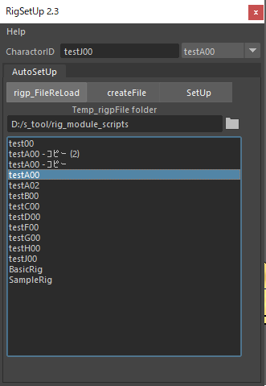
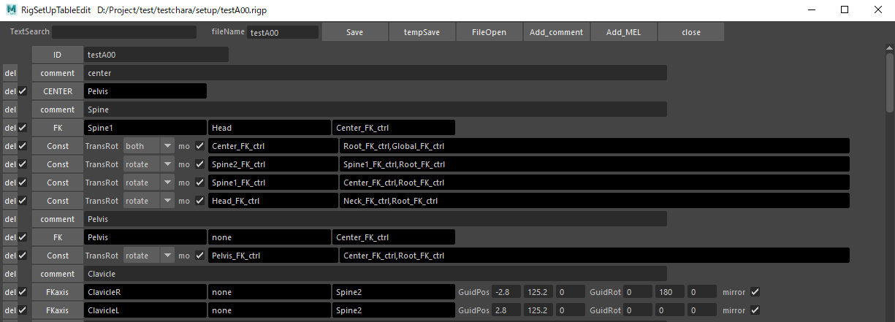
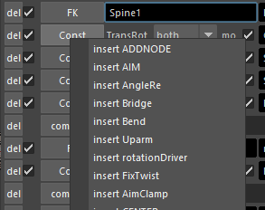
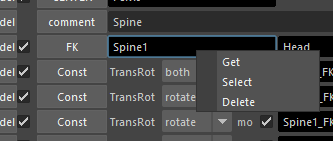

# sRigSetUpの使い方

## 目次

- [sRigSetUpの使い方](#srigsetupの使い方)
  - [目次](#目次)
  - [概要](#概要)
  - [ボタン説明](#ボタン説明)
  - [RigSetUpTableEdit](#rigsetuptableedit)
  - [UI](#ui)
    - [各機能を追加するボタンの説明](#各機能を追加するボタンの説明)
  - [注意事項](#注意事項)

## 概要

このMELスクリプトは、Mayaでリギングをするためのツールです。  

前提条件として

- モデルにジョイントがバインドされたデータ。
- Root以外の各ジョイントの向きはX+方向
- リファレンスモデルにセットアップする前提です。

リファレンスしてからリグを入れる前のmbやmaで保存しておくとセットアップのトライアンドエラーがやりやすいです。SetUp実行時にこのファイルを開いてから実行します。  
シーン内にあるネームスペース（ID）はプルダウンメニューから選択できます  
キャラの原点グランドコントローラは自動で作成されます。
原点にRootがあるほうが良さそうです。
ジョイントの名称に決まりはありません。

## ボタン説明

- CharactorID : キャラクターID名を設定します。  
リファレンスのネームスペースが自動的に入力されるので、そのままで問題ありません。  
複数のキャラがいる場合はリグを入れたいキャラ名を入力してください。

- rigp_FileReLoad : rigpファイルのリストをリロードします。

- createFile : 始めに使用するボタンです。モデルデータをリファレンスで読み込んで、このボタンを押します。
  - 保存する名称を入力するウインドウが出るので入力してOKしてください。  
  - ベースとなる `BasicRig.rigp` を選択すると、シーンから推測してテーブルが作られます。
  - あとは手作業でテーブルを編集してください。  

- SetUp : 自動リグセットアップの実行
  - 再度ボタンを押すと読み込んだシーンを開きなおしてセットアップを実行します。エラーが出た時に便利です。

- rigpFileFolder : どのプロジェクトからでも参照できるrigp置き場です。  
基本となるrigpファイルを置いておくと、新規データ作成時が楽になります。  
`BasicRig.rigp` `SampleRig.rigp` を参考にプロジェクト専用のファイルを作成してください。  

rigpファイルはプロジェクトフォルダの `setup` フォルダを使用します。

- パターンリスト : 項目をダブルクリックするとテーブルUIが表示されます。
パターンリストを右クリックFileOpenするとテキストが開きます

## RigSetUpTableEdit

RigSetUpTableEditは親から順に実行されます  
親ルートから順に項目を1行づつ設定していきます  
FK、IK、スプラインIK、連動処理、コンストレイン処理  
武器などアイテムのFK  
リバースフット  
表示非表示切り替え処理の順です  
最後はコントローラのサイズ変更などです

## UI

- TextSearch : テーブル内の検索文字をハイライトします
- fileName : rigpの名前です。特に何も変更することはありません

- Save : テーブルを保存します
- tempSave : rigpFileFolderのフォルダに保存されます
- FileOpen : テキストエディターで開きます

### 各機能を追加するボタンの説明

テーブル内の機能ボタンを右クリックで表示される項目の説明です。

- comment : コメントを書き込む行を追加
- MEL : MELを記入する行を追加
- FK : FKを追加
- SIK : スプラインIK
- SIKFK : スプラインIK FK切り替え可能
- RIB : リボンリグ
- Parent : コントローラをペアレントします。ほとんど使用する機会はないです
- Const : ペアレントコンストレインの設定を追加
- Swiche : メッシュの表示切替をしてスイッチする機能
- CTRL : コントローラのカーブを置き換えます
- ADDNODE : トランスフォームノードやFKを作成する機能
- CLAMP : Aの回転に対してBを回転させる機能。主にスカート系
- rDriver : rotateDriverを使用した。曲げとねじりを分離した処理
- FixTwist : 自作版の曲げとねじりを分離した処理
- Bend : 自作版の曲げとねじりを分離した処理
- Uparm : rotateDriverを使用した。Uparm用の処理
- Bridge : ジョイント間にナーブスを作成して、中間座標を得る機能
- AngleRe : 回転に対して１つのアトリビュートを連動させる機能
- AIM : エイムコンストレイン機能
- CENTER : 中心コントローラを設定する機能
- Distance : ❓
- Div : ❓
- FKold : ジョイントの向きと同じFKを作成します
- EFK : 空のFKを作成する機能
- IKd : シンプルなIK。末端は移動と回転がコントローラが別
- IKsds : ソフトIKで中間が二重関節、中間の移動も可能。末端は移動と回転が別
- IKid : 動物用のIK。末端は移動と回転がコントローラが別
- ReverseFoot : 昔ながらのリバースフット機能
  - 足の裏の前後左右の４つと母指球あたりに１つ、合計5つのノードをADDNODEで配置してから実行します。
- eCurve : ノードやメッシュ頂点からカーブを作る機能
- Scale : コントローラをスケール制御用にする機能
- AimClamp : ❓

行の一番左の `del` はその行を削除します。  
次にチェックボックスはその行を有効にするか無効にするかのチェックボックス  
機能名ボタンを右クリックすると機能の項目が表示されます。  
選択すると一行上に挿入されます

行の文字を入力するフィールドを右クリックすると項目が表示されます

- Get : シーンのノードを選択してからGetするとフィールドに入力されます。
  - Createで作成されたノードの情報を取得します。
- Select : フィールドに書かれたノードを選択できます。
- Delete : フィールドの文字を消します。
- none : フィールドにnoneと記入されます。
- Create : シーンにガイドノードが作成されます。
- UpGuid_Create : スプラインIK用のアップノードガイドが作成されます。
- UpGuid_Get : アップノードガイドから値を取得します。

## 注意事項

RigSetUpTableEditで編集中のファイルをテキストエディターで開いている時はRigSetUpTableEditのSaveが出来ません

記述順序を変更するときはテキストエディターで編集する方が早いです
