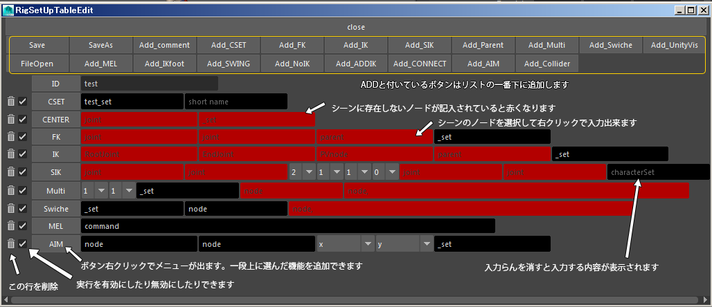

# sRigSetUp

## sRigの概要

スクリプトでリグを仕込むツールです。  
前提条件として  
モデルにジョイントがバインドされたデータ。
Root以外の各ジョイントの向きは子にX+が向いていること  
IKやスプラインIKを使用するジョイントの向きはX+であることが必須です。
リファレンスモデルにセットアップする前提です。  
シーン内にあるネームスペース（ID）はプルダウンメニューから選択できます  
キャラの原点グランドコントローラは自動で作成されます

## 手順

RigSetUpTableEditで項目を1行単位で書きます。  
ルートから順番にセットアップ処理を書いていきます。
次にマルチコンストレイン処理。  
親変更処理。武器などアイテム用  
次に表示非表示切り替え処理の順です。  
RigSetUpTableEditで編集中のファイルをテキストエディターで開いている時はRigSetUpTableEditのSaveが出来ません
AoutSetUp実行はテキストファイルrigfを読み込んで実行しています。

## rigpファイルの内容

上記のUIでFileOpenするとテキストエディターでrigpを開きます

記述順序を変更するときはテキストを編集する方が早いです。

一度作成したrigpファイルをコピーしてファイル名を変更すると他のキャラクターセットアップが楽です

rig_module_scripts\BaseRig.rigpを使用して基本的なリグ設定で作成します。
uniqueの行以降はキャラクターのジョイントを自動で検索してFKやスプラインIKなどが書き込まれます。
正確ではないので、各行を確認してください。

